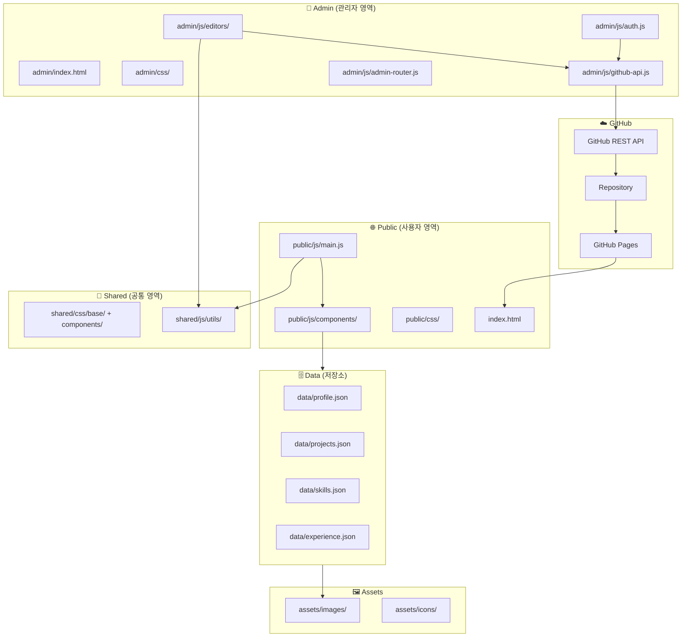
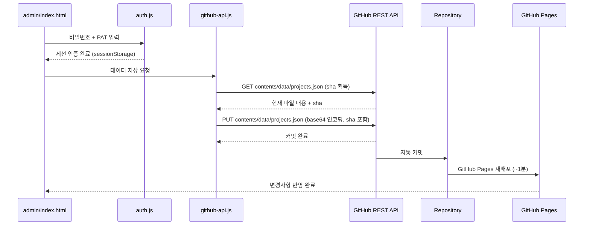

# Design Document: Portfolio Restructure

## Overview

박현정 개발자의 포트폴리오 사이트를 단일 파일 구조에서 **사용자(public) / 관리자(admin) / 저장소(data) / 공통(shared)** 영역으로 분리된 확장 가능한 구조로 재설계한다.

**핵심 목표**:
- 사용자 영역: JSON 기반 동적 렌더링으로 포트폴리오 콘텐츠 조회
- 관리자 영역: 프로필·프로젝트·스킬·경력 CRUD (등록/수정/삭제)
- 데이터 영속성: GitHub API를 통해 JSON 파일을 직접 수정 → GitHub Pages 자동 배포 반영
- GitHub Pages 정적 배포 유지 (빌드 도구 없음, Vanilla JS)

---

## 1. 아키텍처



### 데이터 영속성 전략 (핵심 결정)

**GitHub API 방식** 채택:



**선택 이유**:
- GitHub Pages 정적 환경에서 유일하게 실질적인 서버리스 데이터 쓰기 방법
- PAT(Personal Access Token)는 sessionStorage에만 보관 (탭 종료 시 삭제)
- 개인 포트폴리오 특성상 보안 수준 적합

---

## 2. 목표 디렉토리 구조

```
portfolio/
├── index.html                            # 사용자 진입점
│
├── assets/
│   ├── images/
│   │   ├── profile/
│   │   │   └── avatar.webp               # 프로필 이미지
│   │   └── projects/
│   │       └── *.webp                    # 프로젝트 썸네일
│   └── icons/
│       └── *.svg
│
├── public/                               # 사용자 전용
│   ├── css/
│   │   ├── sections/
│   │   │   ├── hero.css
│   │   │   ├── about.css
│   │   │   ├── skills.css
│   │   │   ├── projects.css
│   │   │   ├── experience.css
│   │   │   └── contact.css
│   │   ├── layout/
│   │   │   ├── navbar.css
│   │   │   └── footer.css
│   │   └── main.css                      # @import 진입점
│   └── js/
│       ├── components/
│       │   ├── navbar.js
│       │   ├── typing.js
│       │   ├── fade-in.js
│       │   ├── scroll-top.js
│       │   ├── profile-renderer.js       # Hero + About + Contact 렌더
│       │   ├── skills-renderer.js        # Skills 그리드 렌더 + 탭 필터
│       │   ├── projects-renderer.js      # 프로젝트 카드 렌더
│       │   └── experience-renderer.js   # 경력 타임라인 렌더
│       └── main.js                       # 모듈 초기화 진입점
│
├── admin/                                # 관리자 전용
│   ├── index.html                        # 관리자 대시보드
│   ├── css/
│   │   ├── layout/
│   │   │   ├── sidebar.css
│   │   │   └── dashboard.css
│   │   └── admin.css                     # @import 진입점
│   └── js/
│       ├── auth.js                       # 비밀번호 + PAT 인증
│       ├── github-api.js                 # GitHub REST API 클라이언트
│       ├── admin-router.js               # 해시 기반 뷰 전환
│       ├── editors/
│       │   ├── profile-editor.js         # 프로필 편집
│       │   ├── projects-editor.js        # 프로젝트 CRUD
│       │   ├── skills-editor.js          # 스킬 CRUD
│       │   └── experience-editor.js      # 경력 CRUD
│       └── admin-main.js                 # 관리자 진입점
│
├── shared/                               # 공통 영역
│   ├── css/
│   │   ├── base/
│   │   │   ├── variables.css             # 디자인 토큰
│   │   │   ├── reset.css
│   │   │   └── typography.css
│   │   └── components/
│   │       ├── buttons.css
│   │       ├── cards.css
│   │       ├── forms.css                 # 공통 폼 (admin + public)
│   │       └── animations.css
│   └── js/
│       └── utils/
│           ├── data-loader.js            # JSON fetch + 캐시
│           ├── sanitize.js              # XSS 방지 이스케이프
│           ├── dom.js                    # DOM 헬퍼
│           └── scroll.js                # 스크롤 유틸
│
├── data/
│   ├── profile.json
│   ├── projects.json
│   ├── skills.json
│   └── experience.json
│
└── README.md
```

---

## 3. 데이터 모델 (완전 정의)

### profile.json

```json
{
  "name": "박현정",
  "nameEn": "Hyeonjeong Park",
  "greeting": "Hello, I'm",
  "roles": ["Backend Developer", "DB Optimization Specialist", "System Integrator"],
  "about": {
    "summary": "Java 기반 웹 개발 · DB 최적화 · 시스템 통합 전문가",
    "description": "공공기관·민간 프로젝트에서 백엔드 설계부터 DB 최적화까지 담당한 풀스택 지향 개발자입니다.",
    "image": "assets/images/profile/avatar.webp"
  },
  "stats": [
    { "icon": "🏢", "label": "다양한 클라이언트", "value": "8+ 프로젝트" },
    { "icon": "⚡", "label": "DB 성능 개선",      "value": "최대 70% 향상" },
    { "icon": "🔒", "label": "보안점검",           "value": "공공기관 대응 경험" }
  ],
  "contact": {
    "email": "tgc99035@naver.com",
    "github": "https://github.com/joug11",
    "blog": "https://blog.naver.com/im_istp"
  }
}
```

### projects.json

```json
[
  {
    "id": 1,
    "title": "공학적 방벽 3차원 모니터링 시스템",
    "org": "한국원자력환경공단 (경주)",
    "desc": "PostgreSQL 파티셔닝 및 부분인덱스 적용으로 쿼리 응답속도 1.54s → 471ms 개선.",
    "tags": ["PostgreSQL", "파티셔닝", "HikariCP", "성능최적화"],
    "accent": "cyan",
    "image": "assets/images/projects/project1.webp",
    "links": { "github": null, "demo": null },
    "order": 1,
    "visible": true
  }
]
```

**accent 허용값**: `"cyan"` | `"green"` | `"purple"` | `"orange"` | `"blue"` | `"pink"` | `"yellow"` | `"teal"`

### skills.json

```json
[
  {
    "id": 1,
    "category": "backend",
    "label": "Backend",
    "order": 1,
    "visible": true,
    "items": [
      { "id": 1, "name": "Java",              "level": 5 },
      { "id": 2, "name": "Spring Framework",  "level": 4 },
      { "id": 3, "name": "eGovFramework",     "level": 4 },
      { "id": 4, "name": "JSP / Servlet",     "level": 4 },
      { "id": 5, "name": "MyBatis",           "level": 4 }
    ]
  },
  {
    "id": 2,
    "category": "database",
    "label": "Database",
    "order": 2,
    "visible": true,
    "items": [
      { "id": 1, "name": "MySQL",             "level": 4 },
      { "id": 2, "name": "PostgreSQL",        "level": 5 },
      { "id": 3, "name": "Oracle",            "level": 3 },
      { "id": 4, "name": "MariaDB",           "level": 3 },
      { "id": 5, "name": "DB 파티셔닝",       "level": 4 },
      { "id": 6, "name": "인덱스 최적화",     "level": 4 },
      { "id": 7, "name": "HikariCP",          "level": 3 }
    ]
  }
]
```

**level**: 1~5 (숙련도 표시용, 렌더러에서 선택적으로 사용)

### experience.json

```json
[
  {
    "id": 1,
    "period": "2026 ~ 현재",
    "startDate": "2026-01",
    "endDate": null,
    "order": 1,
    "visible": true,
    "items": [
      { "id": 1, "text": "벽산엔지니어링 주상도 통합관리 고도화", "detail": null },
      { "id": 2, "text": "FMS 시설관리 시스템 신규 개발 착수",   "detail": null }
    ]
  },
  {
    "id": 2,
    "period": "2025",
    "startDate": "2025-01",
    "endDate": "2025-12",
    "order": 2,
    "visible": true,
    "items": [
      { "id": 1, "text": "귀어귀촌 통합관리 시스템 개발", "detail": null }
    ]
  }
]
```

---

## 4. 컴포넌트 인터페이스 (전체 정의)

### 4-1. DataLoader (shared/js/utils/data-loader.js)

```javascript
class DataLoader {
  constructor()

  // JSON 로드 (메모리 캐시 우선)
  async load(path: string): Promise<object | array>

  // 병렬 로드
  async loadAll(paths: string[]): Promise<(object | array)[]>

  // 캐시 초기화
  clearCache(): void
}
```

**동작**:
- `fetch()` 실패 시 `[]` 반환 (렌더링 중단 방지)
- 동일 path 재요청 시 캐시에서 즉시 반환

---

### 4-2. ProfileRenderer (public/js/components/profile-renderer.js)

```javascript
class ProfileRenderer {
  constructor(dataLoader: DataLoader)

  // Hero 섹션 (이름, roles) 렌더링
  renderHero(profile: ProfileData): void

  // About 섹션 (소개 + stats) 렌더링
  renderAbout(profile: ProfileData): void

  // Contact 섹션 렌더링
  renderContact(profile: ProfileData): void
}
```

---

### 4-3. ProjectsRenderer (public/js/components/projects-renderer.js)

```javascript
class ProjectsRenderer {
  constructor(containerSelector: string, dataLoader: DataLoader)

  // 전체 카드 렌더링 (visible: true 항목만, order 순)
  async render(projects: ProjectData[]): Promise<void>

  // 단일 카드 HTML 생성
  buildCard(project: ProjectData, index: number): string
}
```

---

### 4-4. SkillsRenderer (public/js/components/skills-renderer.js)

```javascript
class SkillsRenderer {
  constructor(containerSelector: string)

  // 카테고리별 그리드 렌더링 (visible: true, order 순)
  render(skills: SkillCategory[]): void

  // 탭 필터 초기화 (렌더 후 호출)
  initTabs(): void

  // 카테고리 필터
  filterByCategory(category: string): void
}
```

---

### 4-5. ExperienceRenderer (public/js/components/experience-renderer.js)

```javascript
class ExperienceRenderer {
  constructor(containerSelector: string)

  // 타임라인 렌더링 (visible: true, order 순)
  render(experience: ExperienceData[]): void
}
```

---

### 4-6. Navbar (public/js/components/navbar.js)

```javascript
class Navbar {
  constructor(navbarId: string, menuId: string, hamburgerId: string)
  init(): void
  updateActiveLink(sectionIds: string[]): void
}
```

---

### 4-7. TypingAnimation (public/js/components/typing.js)

```javascript
class TypingAnimation {
  constructor(elementId: string, texts: string[])
  start(delayMs?: number): void
  stop(): void
}
```

---

### 4-8. GitHubApiService (admin/js/github-api.js)

```javascript
class GitHubApiService {
  constructor(owner: string, repo: string, pat: string)

  // 파일 읽기 (content + sha 반환)
  async getFile(path: string): Promise<{ content: object, sha: string }>

  // 파일 쓰기 (sha 필수 - 덮어쓰기 충돌 방지)
  async putFile(path: string, data: object, sha: string, message: string): Promise<void>
}
```

**구현 세부**:
```javascript
// getFile
GET https://api.github.com/repos/{owner}/{repo}/contents/{path}
Authorization: Bearer {pat}
→ response.content (base64) → atob() → JSON.parse()
→ response.sha 보관

// putFile
PUT https://api.github.com/repos/{owner}/{repo}/contents/{path}
{ "message": "...", "content": btoa(JSON.stringify(data)), "sha": sha }
```

---

### 4-9. AdminAuth (admin/js/auth.js)

```javascript
class AdminAuth {
  // 비밀번호 검증 (SHA-256 해시 비교)
  static async verify(password: string): Promise<boolean>

  // PAT 세션 저장
  static savePAT(pat: string): void

  // PAT 세션 조회
  static getPAT(): string | null

  // 로그아웃 (sessionStorage 전체 삭제)
  static logout(): void

  // 인증 여부 확인
  static isAuthenticated(): boolean
}
```

**보안 원칙**:
- `ADMIN_HASH` 상수는 `auth.js`에 SHA-256 해시로 저장 (평문 비밀번호 없음)
- PAT는 `sessionStorage`에만 저장 (탭 종료 시 자동 삭제)
- `localStorage` 사용 금지 (PAT 영속 보관 방지)

---

### 4-10. AdminRouter (admin/js/admin-router.js)

```javascript
class AdminRouter {
  constructor(routes: { [hash: string]: () => void })
  init(): void
  navigate(hash: string): void
}
```

**라우트 목록**:
```
#/profile    → ProfileEditor
#/projects   → ProjectsEditor
#/skills     → SkillsEditor
#/experience → ExperienceEditor
#/settings   → GitHub 설정 (owner, repo 확인)
```

---

## 5. 관리자 대시보드 UI 설계

### 레이아웃

```
┌──────────────────────────────────────────────────────────────┐
│  DEV.HJ Admin                               [미리보기] [로그아웃] │
├─────────────┬────────────────────────────────────────────────┤
│             │                                                │
│  📋 프로필  │  [현재 섹션 콘텐츠]                           │
│  📁 프로젝트 │                                               │
│  🛠 스킬    │                                                │
│  📅 경력    │                                                │
│             │                                                │
│  ─────────  │                                                │
│  ⚙ 설정    │                                                │
│             │                                                │
└─────────────┴────────────────────────────────────────────────┘
```

### 로그인 화면

```
┌──────────────────────────────────┐
│         DEV.HJ Admin             │
│                                  │
│  비밀번호  [________________]    │
│  GitHub PAT [________________]   │
│                                  │
│         [로그인]                 │
│                                  │
│  ※ PAT는 이 탭에서만 유지됩니다  │
└──────────────────────────────────┘
```

### 프로젝트 편집 화면

```
┌─────────────────────────────────────────────────────────────┐
│  프로젝트 관리                              [+ 새 프로젝트]  │
├─────────────────────────────────────────────────────────────┤
│  ☰  ● 공학적 방벽 3차원 모니터링 시스템  [수정] [삭제] [👁] │
│  ☰  ● 주상도 통합관리 시스템             [수정] [삭제] [👁] │
│  ☰  ● 귀어귀촌 통합관리 시스템          [수정] [삭제] [👁]  │
├─────────────────────────────────────────────────────────────┤
│  [편집 폼 - 선택된 항목]                                    │
│  제목   [______________________]                            │
│  기관   [______________________]                            │
│  설명   [________________________]                          │
│  태그   [Java] [Spring] [+ 추가]                            │
│  색상   [●cyan][●green][●purple]...                        │
│  이미지 [파일 선택...]                                      │
│  링크   GitHub [______] Demo [______]                       │
│         [취소]          [저장 및 게시]                      │
└─────────────────────────────────────────────────────────────┘
```

**☰**: 드래그 없이 [▲][▼] 버튼으로 순서 변경
**[👁]**: visible 토글 (숨김/표시)
**[저장 및 게시]**: GitHub API로 JSON 커밋 → Pages 재배포 (~1분)

---

## 6. 메인 초기화 알고리즘 (public/js/main.js)

```pascal
ALGORITHM initPortfolio()
INPUT: DOMContentLoaded 이벤트
OUTPUT: 초기화된 포트폴리오 페이지

BEGIN
  // 1. 로딩 상태 표시
  showSkeleton(['#projects-grid', '#skills-grid', '#experience-timeline'])

  // 2. 데이터 병렬 로드
  loader ← new DataLoader()
  [profile, projects, skills, experience] ← AWAIT loader.loadAll([
    'data/profile.json',
    'data/projects.json',
    'data/skills.json',
    'data/experience.json'
  ])

  // 3. 콘텐츠 렌더링 (데이터 의존)
  profileRenderer ← new ProfileRenderer(loader)
  profileRenderer.renderHero(profile)
  profileRenderer.renderAbout(profile)
  profileRenderer.renderContact(profile)

  projectsRenderer ← new ProjectsRenderer('#projects-grid', loader)
  AWAIT projectsRenderer.render(projects)

  skillsRenderer ← new SkillsRenderer('#skills-container')
  skillsRenderer.render(skills)
  skillsRenderer.initTabs()

  experienceRenderer ← new ExperienceRenderer('#experience-timeline')
  experienceRenderer.render(experience)

  // 4. 스켈레톤 제거
  hideSkeleton()

  // 5. UI 컴포넌트 초기화 (데이터 독립)
  navbar ← new Navbar('navbar', 'navMenu', 'hamburger')
  navbar.init()

  typing ← new TypingAnimation('typingText', profile.roles)
  typing.start(800)

  fadeIn ← new FadeInObserver('.fade-in')
  fadeIn.observe()

  scrollTop ← new ScrollTopButton('scrollTop')
  scrollTop.init()
END
```

---

## 7. 스켈레톤 로딩 전략

JSON fetch 중 콘텐츠 영역에 스켈레톤 UI 표시:

```html
<!-- projects-grid 스켈레톤 예시 -->
<div id="projects-grid" class="skeleton-grid">
  <div class="skeleton-card"></div>
  <div class="skeleton-card"></div>
  <div class="skeleton-card"></div>
</div>
```

**showSkeleton()**: 대상 컨테이너에 `.skeleton-loading` 클래스 추가
**hideSkeleton()**: `.skeleton-loading` 클래스 제거, 실제 콘텐츠로 교체

---

## 8. CSS 아키텍처

### public/css/main.css

```css
/* 1. Shared Base */
@import '../../shared/css/base/variables.css';
@import '../../shared/css/base/reset.css';
@import '../../shared/css/base/typography.css';

/* 2. Shared Components */
@import '../../shared/css/components/buttons.css';
@import '../../shared/css/components/cards.css';
@import '../../shared/css/components/animations.css';

/* 3. Public Layout */
@import './layout/navbar.css';
@import './layout/footer.css';

/* 4. Public Sections */
@import './sections/hero.css';
@import './sections/about.css';
@import './sections/skills.css';
@import './sections/projects.css';
@import './sections/experience.css';
@import './sections/contact.css';
```

### admin/css/admin.css

```css
/* 1. Shared Base */
@import '../../shared/css/base/variables.css';
@import '../../shared/css/base/reset.css';
@import '../../shared/css/base/typography.css';

/* 2. Shared Components (public과 공유) */
@import '../../shared/css/components/buttons.css';
@import '../../shared/css/components/cards.css';
@import '../../shared/css/components/forms.css';  /* 관리자 폼 공통 */

/* 3. Admin Layout */
@import './layout/sidebar.css';
@import './layout/dashboard.css';
```

### shared/css/base/variables.css (디자인 토큰)

```css
:root {
  /* 색상 */
  --color-bg:         #0A0F1E;
  --color-bg-card:    #1A2332;
  --color-primary:    #00D4FF;
  --color-text:       #FFFFFF;
  --color-text-muted: #8A9BBD;
  --color-border:     rgba(0, 212, 255, 0.15);

  /* 액센트 팔레트 */
  --accent-cyan:   #00D4FF;
  --accent-green:  #00FF9D;
  --accent-purple: #B47BFF;
  --accent-orange: #FF8C42;
  --accent-blue:   #4A9EFF;
  --accent-pink:   #FF6B9D;
  --accent-yellow: #FFD166;
  --accent-teal:   #00B4A6;

  /* 타이포그래피 */
  --font-title: 'Syne', sans-serif;
  --font-body:  'Noto Sans KR', sans-serif;

  /* 레이아웃 */
  --nav-height:      68px;
  --admin-sidebar:   220px;
  --container:       1180px;
  --radius:          12px;
  --transition:      0.3s ease;

  /* 스켈레톤 */
  --skeleton-base:   #1A2332;
  --skeleton-shine:  #243044;
}
```

---

## 9. 에러 처리

### 시나리오 1: JSON 로드 실패
- **조건**: `data/*.json` 파일 없음 또는 네트워크 오류
- **응답**: `DataLoader`가 `[]` 반환, 콘솔 경고
- **복구**: 각 렌더러는 빈 배열 수신 시 "콘텐츠를 불러올 수 없습니다" 안내 메시지 표시

### 시나리오 2: GitHub API 실패 (관리자)
- **조건**: PAT 만료, 네트워크 오류, 권한 부족
- **응답**: 에러 토스트 메시지 표시 ("저장 실패: [HTTP 상태코드]")
- **복구**: 폼 데이터 유지 (재시도 가능), 로컬에 JSON 다운로드 버튼 제공

### 시나리오 3: SHA 충돌 (관리자 동시 편집)
- **조건**: 다른 탭에서 먼저 저장하여 sha가 변경된 경우
- **응답**: "파일이 변경되었습니다. 새로고침 후 다시 시도해주세요." 안내
- **복구**: 최신 파일 재로드 후 폼에 재표시

### 시나리오 4: DOM 요소 미존재
- **조건**: 컴포넌트 초기화 시 대상 요소 없음
- **응답**: 각 컴포넌트 `init()` 첫 줄 `if (!el) return` 조기 반환
- **복구**: 해당 컴포넌트만 비활성화, 나머지 정상 동작

### 시나리오 5: 이미지 로드 실패
- **조건**: `assets/images/projects/*.webp` 파일 없음
- **응답**: `` 핸들러로 `assets/images/placeholder.webp` 대체
- **복구**: 텍스트 기반 카드 정상 표시

---

## 10. 보안

- **XSS 방지**: `sanitize.js`의 `escapeHtml()` 함수로 JSON → DOM 삽입 시 모든 문자열 이스케이프. `innerHTML` 사용 최소화.
- **PAT 보호**: `sessionStorage`에만 저장, `localStorage` 사용 금지. HTTPS 환경(GitHub Pages) 필수.
- **관리자 접근**: `admin/index.html`은 인증 없으면 로그인 폼만 표시. 민감 데이터(PAT)는 JS 상수로 하드코딩 금지.
- **외부 링크**: `target="_blank"` 링크에 `rel="noopener noreferrer"` 유지.
- **이미지**: 관리자 이미지 업로드는 정적 환경에서 `assets/` 직접 커밋. 파일명 검증 (`/[^a-zA-Z0-9\-_.]/` 차단).

---

## 11. 마이그레이션 전략

기존 단일 파일 구조에서 순차 전환:

```
단계 1 (CSS 분리)
  css/style.css → shared/css/base/
                  shared/css/components/
                  public/css/sections/
                  public/css/layout/
  기능 변경 없음 — 시각적으로 동일

단계 2 (JS 분리)
  js/main.js → shared/js/utils/data-loader.js
               shared/js/utils/sanitize.js
               public/js/components/*.js
               public/js/main.js
  기능 변경 없음 — 동작 동일

단계 3 (데이터 추출)
  index.html 하드코딩 → data/profile.json
                        data/projects.json
                        data/skills.json
                        data/experience.json

단계 4 (동적 렌더링)
  각 섹션을 빈 컨테이너로 변경
  JSON 기반 렌더러로 DOM 생성

단계 5 (관리자 구축)
  admin/ 구조 생성
  GitHubApiService 구현
  각 Editor 구현

단계 6 (스켈레톤 + 에러 UI)
  로딩 상태 및 에러 메시지 추가
```

각 단계는 독립 커밋·배포 가능, 단계 간 롤백 용이.

---

## 12. 성능

- **CSS @import**: GitHub Pages HTTP/2 병렬 로드로 허용 가능 (프로덕션 번들링 불필요)
- **JSON 로드**: `loadAll()`로 4개 병렬 fetch, 캐시로 재요청 방지
- **이미지**: WebP 포맷 권장, `` 적용
- **JS 모듈**: `<script type="module">` 사용으로 자동 defer, 렌더링 블로킹 없음
- **스켈레톤**: CSS `@keyframes shimmer`로 GPU 가속 애니메이션

---

## 13. 테스트 전략

### 단위 테스트

| 대상 | 검증 항목 |
|---|---|
| `DataLoader.load()` | 캐시 동작, fetch 실패 시 `[]` 반환 |
| `ProjectsRenderer.buildCard()` | 입력 데이터 → 유효한 HTML 출력 |
| `SkillsRenderer.filterByCategory()` | 카테고리별 표시/숨김 동작 |
| `sanitize.escapeHtml()` | XSS 문자 이스케이프 검증 |
| `AdminAuth.verify()` | 올바른/잘못된 비밀번호 처리 |
| `GitHubApiService.putFile()` | sha 없을 때 에러 발생 |

### 통합 테스트

- 페이지 로드 후 프로젝트 카드 수 = `projects.json` 항목 수 (`visible: true`만)
- 스킬 탭 클릭 후 해당 카테고리만 표시
- 반응형: 768px 이하에서 햄버거 메뉴 표시
- 관리자 저장 후 GitHub API 호출 확인 (mock)

### 프로퍼티 기반 테스트 (fast-check)

- `buildCard(project, i)` → 반환 HTML은 항상 `<article>` 태그 포함
- `buildCard(project, i)` → `project.tags` 모든 항목이 결과 HTML에 포함
- `DataLoader.load(path)` → 동일 path 두 번 호출 시 항상 동일한 결과

---

## 14. 의존성

**현재 (정적 배포)**:
- Google Fonts (Syne, Noto Sans KR) — CDN
- 외부 JS 라이브러리 없음 (순수 Vanilla JS)
- Web Crypto API (SHA-256 비밀번호 해시) — 브라우저 내장

**향후 확장 시 권장**:
- `DOMPurify` — XSS 방지 강화 (현재 `sanitize.js`로 자체 구현)
- `fast-check` — 프로퍼티 기반 테스트 (개발 의존성)
- `SortableJS` — 드래그 앤 드롭 순서 변경 (관리자 선택 사항)
- GitHub Actions — 배포 후 캐시 버스팅 자동화
